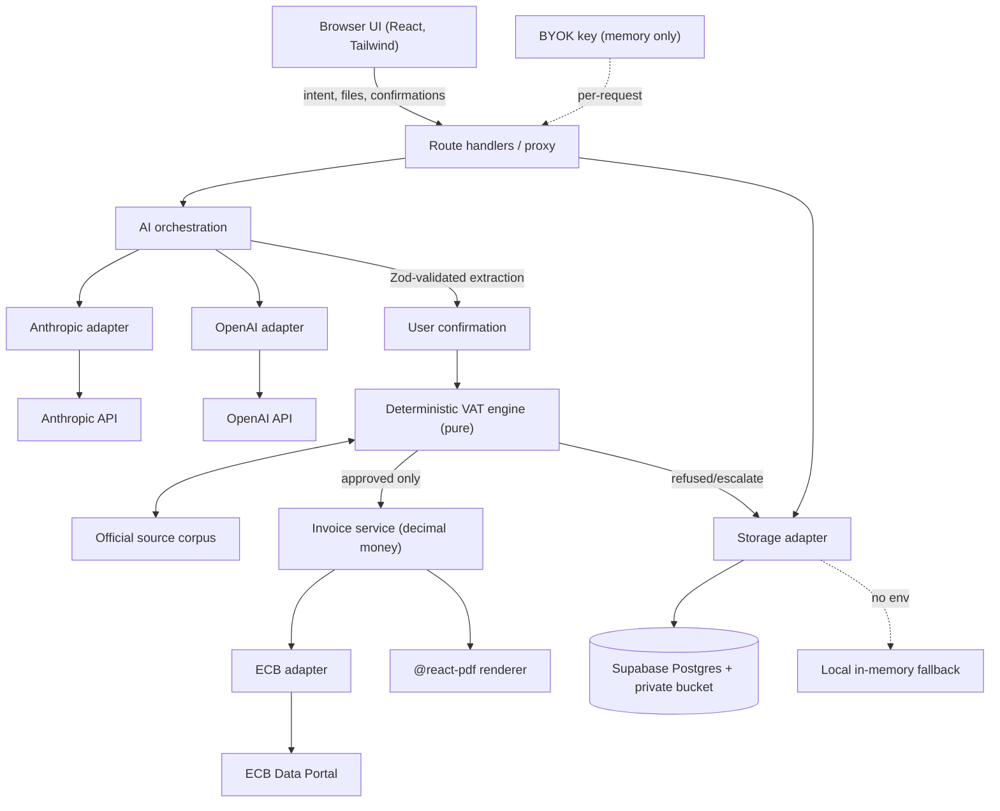

# Architecture

Single Next.js (App Router) application. A hard **trust boundary** separates the
advisory AI from the authoritative deterministic core.

## Layers

| Layer | Path | Rule |
| --- | --- | --- |
| Domain core | `src/domain/**` | PURE. No React, provider SDK, Supabase, or PDF imports. |
| AI | `src/ai/**` | Extraction + phrasing only. Never decides tax. |
| Server | `src/server/**` | Sessions, storage, ECB, orchestration. Server-only. |
| PDF | `src/pdf/**` | Deterministic render of a verified view-model. |
| UI | `src/app/**`, `src/components/**` | Mobile-first shell; no business logic. |

## Data flow (invoice)

1. User describes intent → optional AI extraction (`/api/extract`) → **user confirms** every field.
2. `/api/decision` builds `DecisionInput` (profile injected server-side) → `decide()` → citations + persisted decision run; refused/escalate creates a review case.
3. `/api/invoice` re-runs `decide()` (authoritative). Only an **approved** decision allocates a sequential number, computes totals (decimal.js), fetches ECB FX metadata for non-EUR, renders the PDF, and stores it privately.

## Key invariant

The arrow from AI to the engine passes **only** through Zod schemas and user
confirmation. The AI never writes to invoice totals, numbering, wording, or the
decision. See [trust-boundary.md](./trust-boundary.md).
